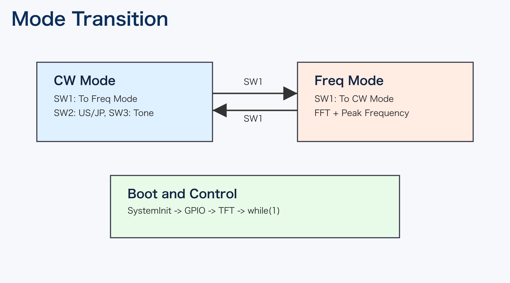
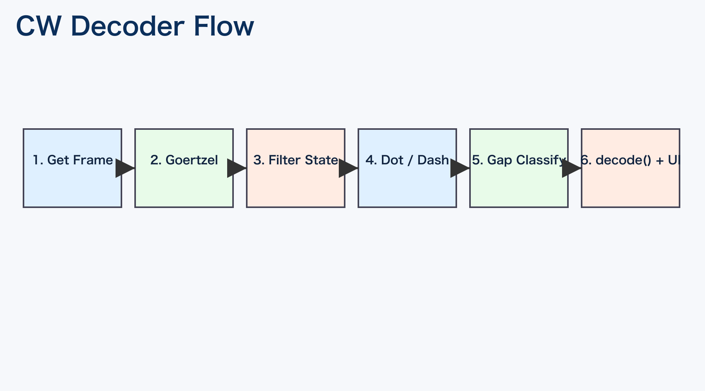

# CW Decoder for UIAP 詳細設計書（簡易版）

## 1. 概要
- 本ソフトは CH32V003 上で動作する CW 受信アプリ。
- 2つの動作モードを持つ。
  - CW Decoder Mode: モールス復号
  - Frequency Detector Mode: FFTによる周波数表示
- `SW1` で2モードを切り替える。

## 2. 全体構成

構成要点:
- `main.cpp` がモード切替の主制御を行う。
- `common.cpp` が GPIO/ADC/タイマ/スイッチの共通処理を提供する。
- CW復号は Goertzel、周波数表示は FFT を使用する。
- 表示は TFT 抽象API経由で ST7735/ST7789 を切替可能。

## 3. モード遷移
- 起動後に初期化を行い、無限ループでモードを順に実行。
- CWモード中に `SW1` 押下で FFTモードへ。
- FFTモード中に `SW1` 押下で CWモードへ。

## 4. CW Decoder Mode

処理の流れ:
1. 音声サンプル取得
2. Goertzelで対象トーン成分を算出
3. しきい値とノイズ抑制でON/OFF状態を決定
4. ON時間から dot/dash 判定
5. OFF時間から文字間/単語間を判定
6. `decode.cpp` テーブルで文字変換し画面へ出力

操作:
- `SW2`: US/JP 切替
- `SW3`: トーン設定切替
- `SW1`: モード終了

## 5. Frequency Detector Mode
- ADCで 128 サンプル取得し FFT 実行。
- 最大ビンからピーク周波数を表示。
- スペクトラムバーを TFT に描画。
- `SW1` 押下でモード終了。

## 6. データとI/O
- 共有バッファ: `shared_buf[256]` を CW/FFT で共用。
- 主な入力:
  - 音声入力: PA2 (ADC)
  - SW1/2/3: PA1/PC4/PD2
- 主な出力:
  - TFT表示
  - LED表示 (CW状態)

## 7. ビルド設定
- `platformio.ini` でターゲットを管理。
- 既定は `TFT_ST7735`。
- 必要に応じて `TFT_ST7789` に切替可能。

## 8. 注意点
- グローバル変数を多用する構成のため、モジュールの独立性は高くない。
- タイミングは実機調整値に依存するため、クロック条件変更時は再調整が必要。
